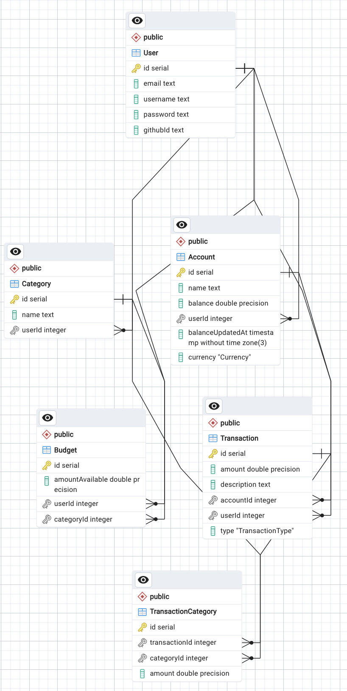

# Personal Finance Management API

Express API built with TypeScript, Prisma, and Zod for a personal finance management application.
It includes authentication with JWT tokens and OAuth integration with Github, account management, category management, transaction management, and budget management.

## Database Schema


## Getting Started

### Prerequisites

Make sure you have the following installed:

- Node.js
- npm (Node package manager)

### Installation

1. Clone the repository:

   ```bash
   git clone https://github.com/your-username/your-repo.git
   cd your-repo
   ```

2. Install the dependencies:

  ```bash
  yarn install
  ```

3. Create a `.env` file in the root of the project and add the following environment variables:

  ```bash
  DATABASE_URL="replace_with_your_database_url"
  GITHUB_CLIENT_ID = "your_github_client_id"
  GITHUB_CLIENT_SECRET = "your_github_client_secret"
  GITHUB_CALLBACK_URL = "http://localhost:3000/api/auth/github/callback"
  SESSION_SECRET="your_session_secret"
  JWT_SECRET="your_secret_key"
  ```

4. Run the migrations and generate the Prisma client:

  ```bash
  npx prisma generate
  ```

5. Build and start the server:

```bash
yarn run build
yarn run start
```

The server will start on `http://localhost:3000`.

## API Endpoints

The API endpoints are documented using Swagger. You can access the Swagger documentation by visiting `http://localhost:3000/api-docs`.

## Built With

- [Express](https://expressjs.com/) - Web framework for Node.js
- [Prisma](https://www.prisma.io/) - Modern database access for TypeScript & Node.js
- [Zod](https://zod.dev/) - TypeScript-first schema declaration and validation library
- [Passport.js](http://www.passportjs.org/) - Authentication middleware for Node.js
- [Swagger](https://swagger.io/) - API documentation tool


